# Daltonize Processing Samples

The following samples were produced using `daltonize.rb`

## Ishihara

[Ishihara colour perception test](https://en.wikipedia.org/wiki/Ishihara_color_test)

### Original
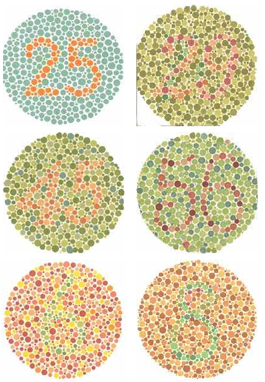

### Deuteranope

### Protanope
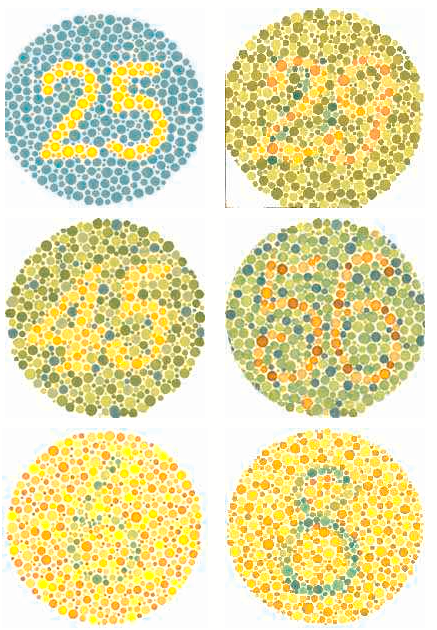

### Tritanope
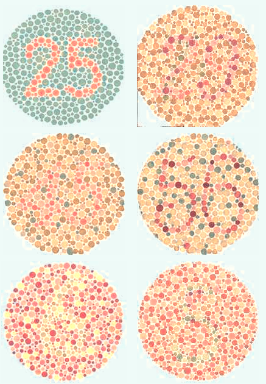

## Colour Palette

Provided by @jcupitt

### Original
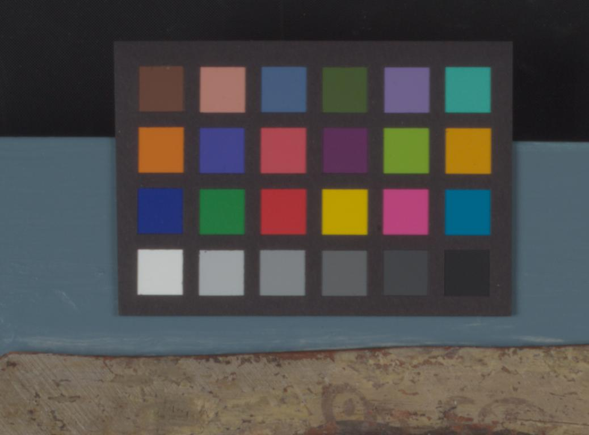

### Deuteranope

### Protanope
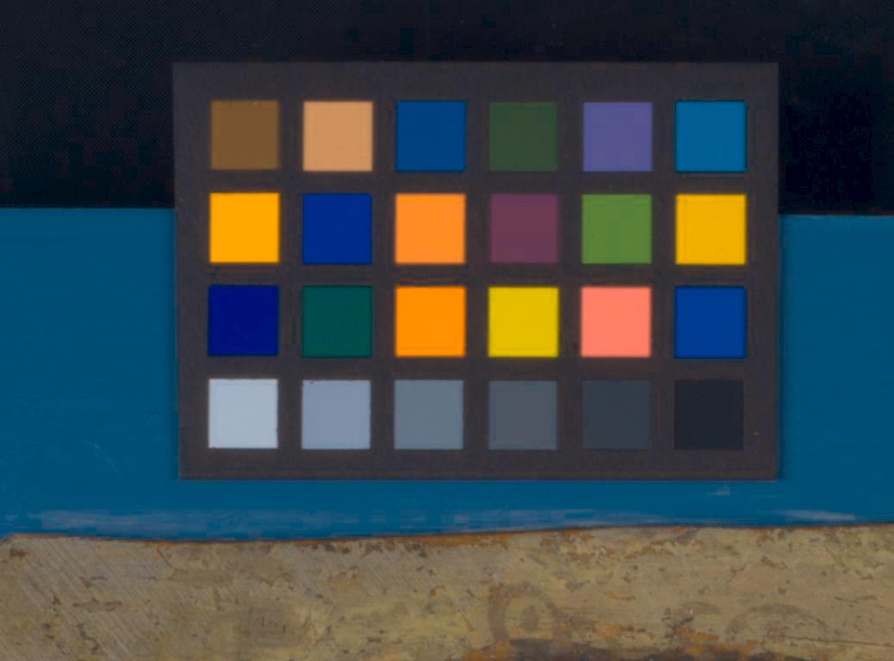

### Tritanope
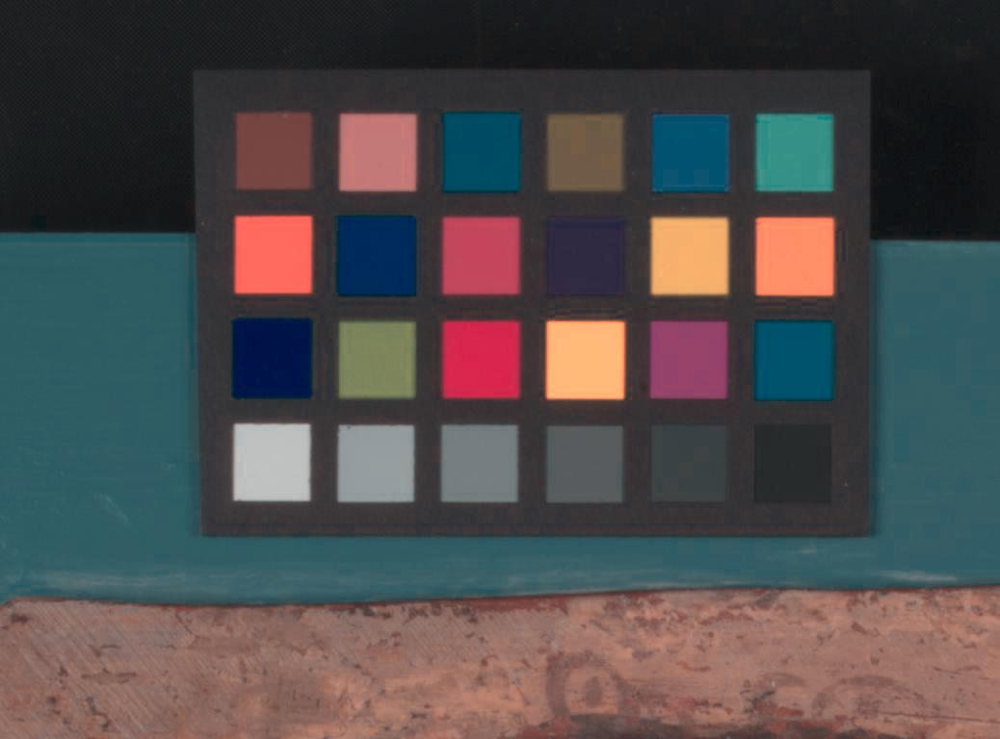

## Wikipedia images

The wikipedia entry for [colour blindness](https://en.wikipedia.org/wiki/Colorblindness) contains a few images that
demonstrate the 3 main colour deficiencies. Each of them were processed using `daltonize.rb` based on the defficiency.

### Deuteranope Original
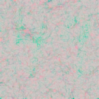

### Deuteranope (processed)
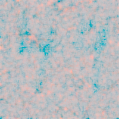

### Protanope Original
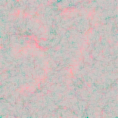

### Protanope (processed)
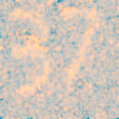

### Tritanope Original
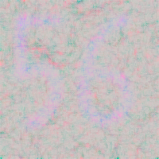

### Tritanope (processed)
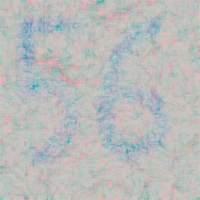
